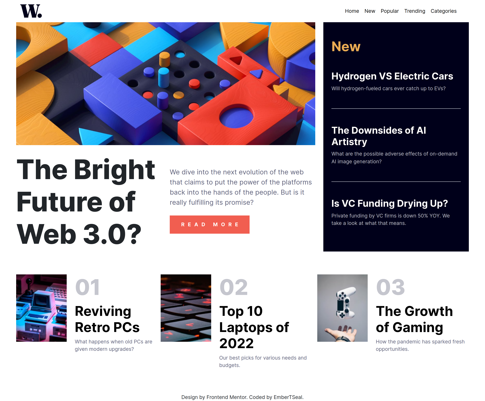

# Frontend Mentor - News homepage solution

This is a solution to the [News homepage challenge on Frontend Mentor](https://www.frontendmentor.io/challenges/news-homepage-H6SWTa1MFl). Frontend Mentor challenges help you improve your coding skills by building realistic projects. 

## Table of contents

- [Overview](#overview)
  - [The challenge](#the-challenge)
  - [Screenshot](#screenshot)
  - [Links](#links)
- [My process](#my-process)
  - [Built with](#built-with)
- [Author](#author)

## Overview

### The challenge

Users should be able to:

- View the optimal layout for the interface depending on their device's screen size
- See hover and focus states for all interactive elements on the page

### Screenshot

#### Wide View: (Laptop 1440px)

#### Mobile View: (375 px)

### Links

- Solution URL: (https://github.com/EmberTSeal/Challenges/tree/main/News-Homepage)
- Live Site URL: (https://embertseal.github.io/News-Homepage)

## My process

### Built with

- Semantic HTML5 markup
- Bootstrap 5
- Mobile-first workflow

## Author

- LinkedIn - [Trisha Seal](https://www.linkedin.com/in/trisha-seal-617a89244/)
- Frontend Mentor - [@EmberTSeal](https://www.frontendmentor.io/profile/EmberTSeal)
- Github - [@EmberTSeal](https://github.com/EmberTSeal)

